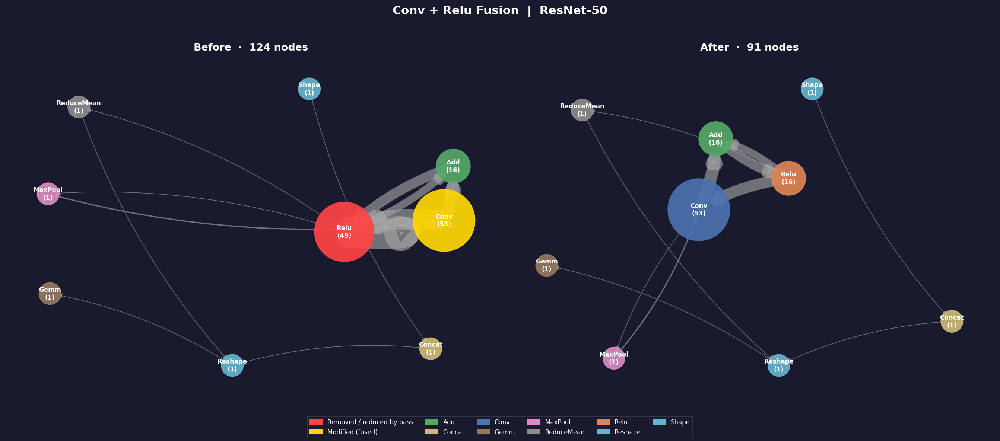
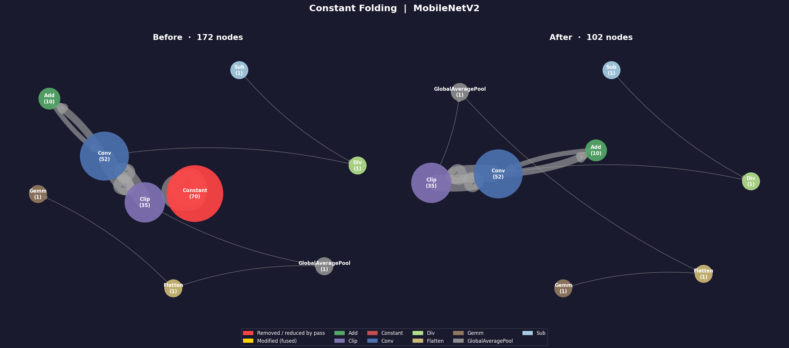
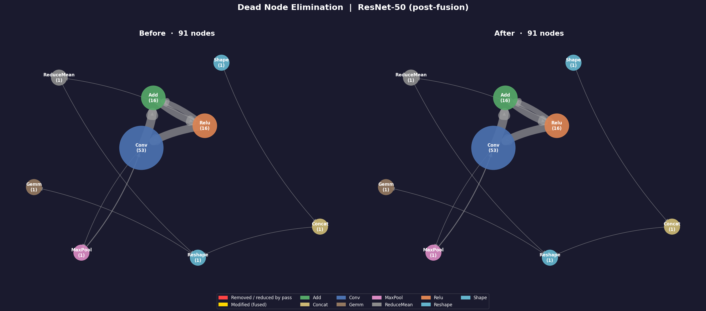

# Graph Diff Visualizations

Before/after cluster-based summary graphs for each optimization pass.
Generated by `python -m graph.visualize`.

---

## Visualization Design: Cluster-Based Summary Graph

Rather than rendering all 124 individual nodes as a standard node-link diagram — which produces an unreadable graph at this scale — `visualize.py` collapses all nodes of the same op type into a single representative node. Each representative node encodes two pieces of information:

- **Size**: proportional to how many individual nodes that op type represents in the full graph
- **Label**: op type name and count

Edges between representative nodes reflect data-flow connections between op types, with edge weight proportional to how many such connections exist in the underlying graph. The result is a compact graph with at most as many nodes as there are distinct op types (8 to 10 for these models), regardless of total graph size.

The topology of the summary graph mirrors the real data-flow structure of the model: Conv feeds into Relu, Relu feeds into Add, Add feeds back into Conv, and so on. The discarded portion (repeated nodes of the same op type )is what makes full node-link diagrams unreadable at this scale.

On the **before** side, nodes affected by the pass are highlighted:

- **Red**: removed or reduced by the pass
- **Gold**: structurally modified (e.g. fused with another op)

On the **after** side, all nodes revert to standard op-type colors with updated counts.

---

## Pass 1: Conv + Relu Fusion — ResNet-50

**Before (124 nodes):** The two dominant nodes are `Relu (49)` highlighted in red and `Conv (53)` highlighted in gold, connected by a heavy bidirectional edge reflecting the 33 direct Conv → Relu data-flow connections that are candidates for fusion. The visual mass of the red Relu node relative to Conv conveys the scale of the redundancy: nearly as many Relu kernel launches as Conv kernel launches, each requiring a separate DRAM read/write of the intermediate tensor.

**After (91 nodes):** The red Relu mass shrinks to `Relu (16)` and reverts to its standard orange color. Conv stays at 53 but shifts to standard blue, indicating its structure is unchanged even though 33 of its instances now absorb the Relu activation internally. The 16 surviving Relu nodes are the residual branch merges that follow Add nodes — skipped by the fusion pass because their producer is not a Conv.

**What the graph proves:** The heavy Conv ↔ Relu edge on the before side is the bandwidth bottleneck. Fusion collapses 33 of those round-trips into zero DRAM transactions by keeping intermediate values in registers inside the Conv kernel. The after side shows the edge thinning as those connections no longer exist as separate kernel boundaries.

---

## Pass 2: Constant Folding — MobileNetV2

**Before (172 nodes):** The large red `Constant (70)` node dominates the center of the graph, visually larger than Conv (52) and Clip (35) combined. These 70 inline Constant nodes represent the ImageNet normalization scalars (mean, std) and other compile-time values that the ONNX exporter emitted as explicit graph nodes rather than initializer table entries. Their connections to Sub and Div reflect the normalization subgraph: `Constant → Sub(input, mean)` and `Constant → Div(result, std)`.

**After (102 nodes):** The Constant node is completely absent from the after side. The remaining graph — Conv, Clip, Add, Sub, Div, GlobalAveragePool, Flatten, Gemm — is structurally identical to the before side, with the same topology and counts. Sub (1) and Div (1) survive because their first operand is the live image tensor, not a constant.

**What the graph proves:** Constant folding is a compile-time optimization — it removes nodes that were doing work TensorRT would have had to process at engine build time, without changing any runtime computation. The after-side graph is what TRT actually receives.

---

## Pass 3: Dead Node Elimination — ResNet-50 (post-fusion)

**Before (91 nodes) and After (91 nodes):** The two sides are visually identical. Every node present before the pass is present after it, with unchanged counts and topology. This is the intended result.

**What the graph proves:** After the fusion pass, ResNet-50 contains no unreachable nodes. The `Shape (1) → Reshape (1)` chain that might appear to be a dead subgraph is in fact live: `Reshape`'s output feeds into `Gemm` (the classifier head), which is a graph-level output. The pass ran, scanned the full graph iteratively until convergence, and found nothing to remove. The identical before/after is a correctness guarantee, not a null result.

**Why this matters for the pipeline:** Dead node elimination is positioned last because upstream passes can create orphaned nodes. If constant folding had left any consumers of the folded constants in the graph, or if fusion had orphaned any intermediate nodes, this pass would have caught them. The clean result on both models confirms the pipeline leaves no unreachable subgraphs.

---

## Summary

| Pass                  | Model       | Before | After | Delta           |
| --------------------- | ----------- | ------ | ----- | --------------- |
| Conv+Relu Fusion      | ResNet-50   | 124    | 91    | -33 (27%)       |
| Constant Folding      | MobileNetV2 | 172    | 102   | -70 (41%)       |
| Dead Node Elimination | ResNet-50   | 91     | 91    | 0 (graph clean) |
